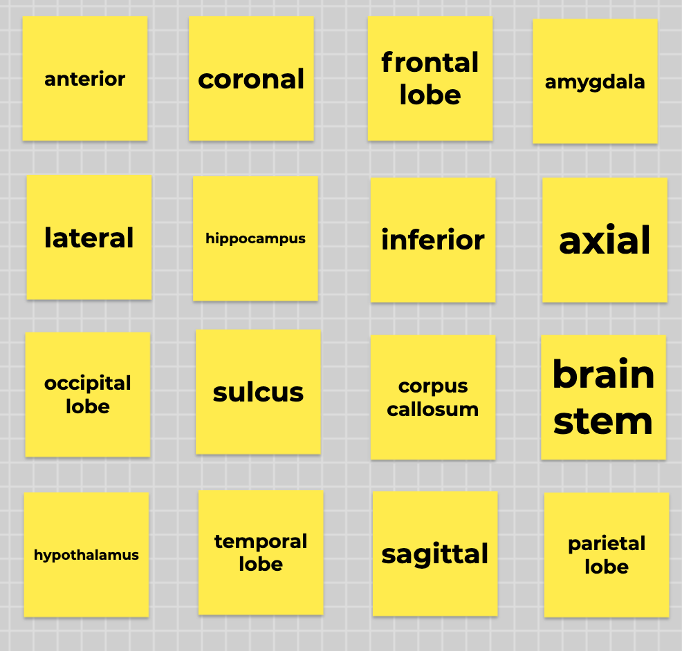

```{r setup, include=FALSE}
knitr::opts_chunk$set(echo = TRUE)
```

This post will show you my motivation and methods for designing and running a game of Zoom bingo, but for basic neuroanatomy! This activity would be appropriate for an introductory psychology or neuroscience class. The instructions below are specific to an online class (the activity was run in the spring 2021 semester), but can be simplified to run in-person. (You can skip all the streaming stuff; that's the most complicated part anyway.)

# What's the activity

It does what it says on the box, pretty much! Each player gets a bingo board with a series of key neuroanatomical terms on it instead of traditional bingo numbers. Instead of calling numbers from a giant rotating cage of balls, the bingo announcer (instructor) shows a series of pictures or verbal descriptions of those key terms. Players must match the picture/definition shown on the screen to the key term on their board, and mark that key term off. Once they mark off a straight line of key terms, that's BRAIN BINGO!

# Why this activity

Paired associations between names and definitions (visual and verbal) are a great candidate for gamification in the classroom to reward successful learning with fun. Bingo works well because students need to correctly remember term-definition pairings in order to play the game, but the object of the game is not specifically "who can identify the most key terms", which hopefully reduces a little bit of stress on students.

**Important: We didn't include a game for the sake of a game, we included a game because we thought it was the best way to test memory for neuroanatomical terms.** A game happened to fit the bill well here, and I'm glad it did, but a game isn't always the best activity for a particular learning objective!

# Materials

# What I did: Step by step methods

## Choose key terms

In some way, this is the most important part of the activity. By choosing the key terms to quiz in bingo, _you are deciding which key terms you want students to know._ Don't take this lightly! ([Backward design](https://cft.vanderbilt.edu/guides-sub-pages/understanding-by-design/) is everywhere.) I kept this in mind when deciding which terms to omit. Intro-level students don't need to be neuroanatomy experts; they only need to know enough to be able to orient themselves when we discuss cognitive neuroscience research in class.

Four our class, we ended up selecting a combination of the key terms presented in the Brain chapter of our course's [textbook](https://catalog.flatworldknowledge.com/catalog/editions/intropsych_bpg-5-1), and a few more based on the judgment of the teaching team (like MRI slice orientations).

## Prepare bingo cards

Columbia has a subscription to the G Suite for Education, which means we have access to [Jamboard](https://jamboard.google.com), Google's interactive whiteboard app. A whiteboard app like Jamboard isn't strictly necessary for an activity like this, but it is useful. We could send students a link to the Jamboard file and direct them to their respective bingo cards on the large whiteboard document, which we could also have open to monitor their progress as they used built-in whiteboard features to mark bingo spots as "called".

Ultimately, Jamboard or not, students just need unique bingo cards that they can annotate somehow to mark when key terms have been called. Bingo cards can even be static screenshot images, with which students would use a markup tool on their own device or mark corresponding locations on a 4x4 grid on a sheet of paper.

I used Jamboard's sticky note feature to create a 4x4 grid of sticky notes on the first frame (or "slide") of a file. I typed in 16 key terms, one in each sticky note, and clicked/dragged to physically shuffle the sticky notes around until the board looked sufficiently pseudo-random.

```{r}

```


To create additional unique bingo cards, I duplicated an existing bingo card, replaced some key terms with other key terms (to ensure that not every bingo card had the exact same items, and so students can't assume every key term appears on their card), and manually shuffled the sticky notes again.

Finally, just in case students encountered Jamboard access issues, I screenshotted every unique bingo card and saved all the labeled screenshots in a folder for students to access just in case.

## Prepare bingo calls

I wanted the ability to test students' recall using both visual cues (e.g. an arrow pointing in a particular anatomical direction) and verbal cues (e.g. a description of a brain region's key functions). The simplest way I found to do this was to create a Google Slides presentation ([PDF export here](brain_bingo_calls.pdf), [contact me](contact) for the Google Slides themselves), where each slide contained a recall cue for one key term. For anatomical directions, imaging slice orientations, and lobes of the cerebrum, I made picture cues. For other brain structures/regions, including subcortical structures, I wrote a short one-sentence description of that region's definition/function based on what students would have seen in the textbook. Each key term had only one cue slide associated with it.

I made these slides in sensible order just to make it easier for me to catalogue all the terms I was adding. To randomize them for bingo presentation, I downloaded the [Slides Randomizer](https://workspace.google.com/marketplace/app/slides_randomizer/464683408022) Google Slides plugin and followed its instructions to randomize the order of all slides (excluding the first slide, on which I typed some instructions). After randomizing, I manually re-ordered a few slides so that there wouldn't be large chunks of consecutive picture cues or verbal cues.

## Prepare computer for streaming

We (the teaching team) had previously decided to run the activity in bingo teams of approximately 4 students. We did this both to allow students to assist each other within teams, and to acclimate students to group work in the class before they were assigned to semester-long project groups the next week of class.

Ordinarily, running an activity like this would only require the instructor screen-sharing into Zoom and students filling out their bingo cards in a separate browser window. However, because we wanted students to work in _teams,_ we had to figure out an alternative that allowed students to _see a screen share while in breakout rooms._ We settled on me streaming my screen to a web link that students could have open while they were in breakout rooms.

For the entire semester, I Zoomed into class from my (2017) iMac desktop in my office. (Per our lab's COVID protocols, only one person was allowed in each office at a time. I would book the office for class time twice a week and leave other times of the week for others to work there.) The iMac provided two main benefits over joining class from my laptop in my apartment: **gigabit wired internet on campus** and **a really big screen**. Both of these features proved key to streaming brain bingo successfully. The internet speed helped ensure the stream wouldn't be patchy, and the large screen allowed me to tile more windows on screen so I could maintain a "control board" for all the programs I needed to keep an eye on.

### Streaming destination: configure YouTube Live

Between all the different streaming sites I could use, I figured YouTube Live would be the easiest. I already had a YouTube account associated with my Columbia Gmail, and it would be easy enough to send the link to students to view without needing to log in themselves.

### Streaming source: configure StreamLabs app

Having never streamed anything before, I didn't realize you can't just share your screen and webcam directly to a stream. You can stream just your webcam, but not with a screen share. Zoom makes it look so easy! I needed to download an _encoder,_  or a tool that would construct a feed from multiple sources that could be sent into a stream. (When Zoom talks with webcam/sceen share are livestreamed to something like YouTube Live, Zoom itself acts as the encoder in this instance.) Based on the [relevant YouTube support page](https://support.google.com/youtube/answer/2907883?hl=en&ref_topic=9257984#zippy=%2Csoftware-encoders), I decided to try the Streamlabs app.

Following [Streamlabs's basic setup guide for Mac](https://blog.streamlabs.com/streamlabs-is-live-on-mac-ff543b7f4a35), I added my YouTube login info to authenticate my future stream, and then did the absolute bare minimum to setup a stream that would show two sources: me on webcam/audio (the default), and a Window Capture of my Google Slides presentation with the brain cue slides.

### Connecting the source to the destination

The last thing I needed to do to hook Streamlabs up to my YouTube Live account was plug in the stream key and stream URL. Following a combination of Streamlabs's guide and [YouTube's instructions](https://support.google.com/youtube/answer/2907883?hl=en&ref_topic=9257984#zippy=%2Cschedule-a-live-stream) to stream from an encoder to a scheduled stream, I copied both pieces of information from the YouTube Live admin editing page for the stream and pasted them into Streamlabs. Clicking "Go Live" in Streamlabs made all my stuff start showing up in YouTube! Wow!!!

## Run the activity

### Prep students

While students were in the main Zoom (and we could reach everyone using the chat), we introduced the review game and sent the links they would need in their breakout rooms:

1. YouTube Live link to the stream
1. Jamboard file link for all the interactive bingo cards
1. Google Drive folder link for static bingo card screenshots (in case of technical difficulty with Jamboard)

Then, when everyone was ready, we used Zoom's random breakout room assignment feature to send students to team breakout rooms. (Our instructor and the other TA stayed in the main Zoom in case of troubleshooting.)

### Start the stream!

Starting the stream would prevent me from using my desktop webcam for Zoom _and_ streaming, so I had to either join the class Zoom on another device to keep an eye on it, or just leave and hope people could communicate with me through the stream chat. I happened to have my laptop with me in my office, so I managed to join the class Zoom on my laptop while closing out of Zoom on my work desktop to start up the stream. I hit "Go Live" on Streamlabs (since I'd already configured the stream link and Streamlabs connection on YouTube Live before class) and we were rolling!

Once on the stream, I introduced the instructions, answered any questions that came in through the stream chat or from the rest of the teaching team in the main Zoom, and then started bingo! I allowed 30 seconds per bingo call--hopefully long enough to give students sufficient time to identify the associated key term, but fast enough to keep the activity moving.

For each bingo call, I announced the photo or the verbal description (e.g. "the next term is THIS anatomical direction"), and then just... kept talking through the 30 seconds for each cue. I tried to announce when 15 seconds and 5 seconds remained for each cue, and made comments and jokes in the rest of the time. For example, if the relevant key term was a lobe of the cerebrum, I might ad-lib about functions associated with that lobe to give students extra "flavor" information.

I know this sounds so glib, but my biggest tip for success in the actual stream is to **look like you're having fun!** Here, adopting advice from [Twitch](https://www.twitch.tv/creatorcamp/en/level-up/new-viewer-retention/) actually helps. Not necessarily to "plug your channel" (I mean, students are enrolled in your class already, no need to plug), but to get in the rhythm of the strange 1.5-sided conversation that occurs between a streamer and viewers. (I think it's actually quite related to the 1.5-sided conversation between an instructor and students, but that's another blog post...)

My second biggest tip is to make sure you are keeping an eye on _all_ necessary windows: the slides, the timer for each slide, the stream chat, and any message channel with the teaching team (incase they notice a technical difficulty).

Overall, I had a lot of fun running it, and students reported that they enjoyed it too! The weirdest thing for me to get used to was the 5-ish second delay between me saying something and it getting streamed to students. When they commented in the chat (which was an effective way to hear from them because we couldn't see their Zoom messages from their breakout rooms!), I had to mentally adjust for comment lag in connecting what they'd typed to what I'd said. Not a huge deal, but I had to remind myself to wait for several seconds after I said something before expecting comments.
