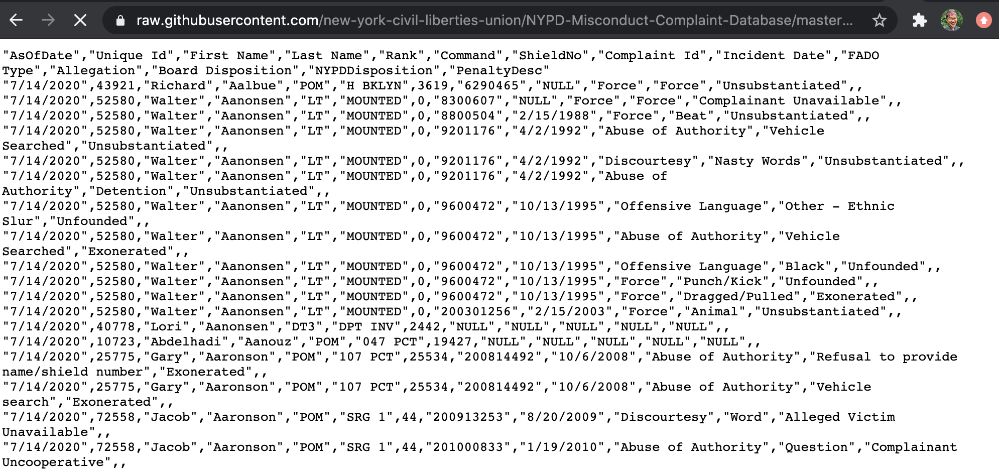

```{r setup, include=FALSE}
options(htmltools.dir.version = FALSE)
require(tidyverse)
require(magrittr)
require(english)
require(DT)
require(knitr)
require(rlang)

these_dt_options <- list(pageLength = 7, dom = "tipr", scrollX = TRUE)
kable_ncol <- function (df, n = 2, ...) {
  dots = enexprs(...)
  df %>% 
  mutate(column = cut(1:n(), breaks = n, labels = FALSE)) %>% 
  nest(data = -column) %>% 
  pull(data) %>% 
  kable({{dots}})
}
this_fill <- "#008ee0"
this_theme <- theme_bw() +
  theme(axis.text = element_text(size = rel(1)),
        axis.title = element_text(size = rel(1.1)),
        title = element_text(size = rel(1.2)))
```

### A non-exhaustive list of related reports

["Mission Failure: Civilian Review of Policing in New York City -- Summary of Findings", NYCLU, 2006](https://www.nyclu.org/en/mission-failure-civilian-review-policing-new-york-city-summary-findings)

["Police Officers Rarely Disciplined by NYPD for Misconduct", WNYC, Aug 27 2014](https://www.wnyc.org/story/nypds-poor-track-record-meting-out-discipline-officer-misconduct/)

["Newly Released Data Shows 1 Out Of Every 9 NYPD Officers Has A Confirmed Record Of Misconduct", Gothamist, July 28 2020](https://gothamist.com/news/nypd-police-ccrb-database-shows-confirmed-record-misconduct)

["The NYPD Is Withholding Evidence From Investigations Into Police Abuse", ProPublica, Aug 17 2020](https://www.propublica.org/article/the-nypd-is-withholding-evidence-from-investigations-into-police-abuse)

["Why The Majority Of NYPD Misconduct Complaints End Up 'Unsubstantiated'", Gothamist, August 18 2020](https://gothamist.com/news/why-the-majority-of-nypd-misconduct-complaints-end-up-unsubstantiated)

["323,911 Accusations of N.Y.P.D. Misconduct Are Released Online", New York Times, Aug 20 2020](https://www.nytimes.com/2020/08/20/nyregion/nypd-ccrb-records-published.html)

["What happened to NYPD officers who were charged with misconduct? They were promoted or paid more." Columbia Spectator, Sept 22 2020](https://www.columbiaspectator.com/news/2020/09/22/what-happened-to-nypd-officers-who-were-charged-with-misconduct-they-were-promoted-or-paid-more/)

---

### The NYPD Misconduct Complaint Database

.pull-left[

From the [New York Civil Liberties Union](https://www.nyclu.org/en/campaigns/nypd-misconduct-database):

>The NYPD Misconduct Complaint Database is a repository of complaints made by the public on record at the Civilian Complaint Review Board (CCRB). These complaints span two distinct periods: the time since the CCRB started operating as an independent city agency outside the NYPD in 1994 and the prior period when the CCRB operated within the NYPD. The database includes 323,911 unique complaint records involving 81,550 active or former NYPD officers. The database does not include pending complaints for which the CCRB has not completed an investigation as of July 2020.

]

.pull-right[


]

???

Image credit: [Wikimedia Commons](https://en.wikipedia.org/wiki/Civilian_Complaint_Review_Board#/media/File:CCRB_logo.png)

---
class: inverse, middle

# Reading the data

---

The data are uploaded on the [New York Civil Liberties Union's GitHub account](https://github.com/new-york-civil-liberties-union/NYPD-Misconduct-Complaint-Database).


---

Clicking the "Download" button takes us to the link for the raw CSV hosted on GitHub.

--

We can see in the browser that this is indeed straight up comma-separated values, so reading data from this link directly into an R dataframe should work smoothly.



---

`readr::read_csv()` allows us to read data directly from the URL of a web-hosted CSV file. Other CSV reading functions would require us to use another function to download the data from the web to our machine first, and then read the CSV into R.

--

We can copy the https link from the GitHub URL of the raw file and feed it in as the `file` argument of `read_csv()`.

---

(Note that we need to add `"NULL"` as one of the values to be rendered as `NA`.)

```{r}
complaints <- read_csv("https://raw.githubusercontent.com/new-york-civil-liberties-union/NYPD-Misconduct-Complaint-Database/master/CCRB_database_raw.csv",
                       na = c("", "NA", "NULL"))

```

---

### Dropping duplicate rows

The NYCLU warns that some of the rows in the data may be duplicated. As a quick pass, we can keep only fully unique rows.

Right now, we have **`r nrow(complaints)`** rows in the data immediately after reading it in.

--

Now, we will de-duplicate the data:

```{r}
complaints %<>%
  distinct()
```

--

Now we have **`r nrow(complaints)`** rows.

That's a non-negligible number of repeat rows we dropped, so good thing we did that.

---

Note the double-sided pipe `%<>%` from `magrittr`, which overwrites the input of the pipe with the output of the pipe after computation is completed.

--

Thus, this bit of code

```{r, eval = FALSE}
complaints %<>%
  distinct()
```

--
is equivalent to, and less verbose than, the following:

```{r, eval = FALSE}
complaints <- complaints %>%
  distinct()
```

--

We will be using the double-sided pipe frequently for the rest of our data processing.

---

### The data in its rawest form

```{r, echo = FALSE}
complaints %>% 
  sample_n(10) %>% 
  datatable(options = these_dt_options)
```

---

### Dropping unnecessary columns

Next, we can drop a couple redundant columns to reduce data size.

--

`AsOfDate` marks the preparation date of the data, so it will be the same for every row since all the data were pulled at once. Thus, the column doesn't need to be repeated over 300,000 times.

--

In addition, `Unique Id`, combined `First Name` & `Last Name`, and `ShieldNo` all uniquely identify officers. Since we have no other data linking shield number to anything else, we may as well drop that column because it's meaningless to us.

--
```{r}
complaints %<>%
  select(-AsOfDate, -ShieldNo)
```

---

### Repairing column names

Next, let's re-spell some column names for ease of later processing.

--

Several of the column names have spaces in them, making them illegal variable names that we would need to quote using backticks in our code.

```{r}
names(complaints)
```

---

We can use the new `dplyr`'s `rename_with()` to run `str_remove_all()` across every column in the data, removing spaces if they are present in the column name.

```{r}
complaints %<>%
  rename_with(~str_remove_all(., " "), .cols = everything())
```

--

```{r}
names(complaints)
```

---

### Changing column data types

Finally, for pre-cleaning, we can change the data type and formatting of some columns to save space and facilitate processing:

--

- change all numeric columns to integer to reduce data size

--

- render any date columns as date-time type

--

We will use `dplyr`'s new `across()` helper function inside of `mutate()` to use logical functions (for coercing numeric columns to integer) and name-based functions (for catching date columns) to choose columns to mutate with a single function.

```{r}
complaints %<>%
  mutate(across(where(is.numeric), as.integer),
         across(ends_with("Date"), lubridate::mdy))
```

---

### The slightly less raw data

```{r, echo = FALSE}
complaints %>% 
  sample_n(20) %>% 
  datatable(options = these_dt_options)
```

---

class: inverse, middle

# What do the columns mean?

---

Note: Much of this info comes from the NYCLU's informal data dictionary on [their website](https://www.nyclu.org/en/campaigns/nypd-misconduct-database).

--

### Officer identifying columns

`UniqueId`, `FirstName`, `LastName`, `Rank`, and `Command` all identify officers. (These entries may be repeated for officers with multiple complaints against them, or for a single complaint with multiple misconduct allegations.)

--

For example, a few randomly selected officers with complaints against them:

```{r, echo = FALSE}
complaints %>% 
  select(UniqueId:Command) %>% 
  distinct() %>% 
  sample_n(5) %>%
  kable()
```

Note that `Rank` and `Command` appear to index officers' most recent rank at time of database pull, not their rank at time of incident. For example, officers with multiple complaints lodged against them over the years have only one rank listed for all those complaints.

--

The rest of the columns are specific to each complaint.

---

### Incident identifying columns

`ComplaintId` and `IncidentDate` identify whole incidents. Values may be repeated for incidents with multiple misconduct allegations occurring within a single police encounter.

The rest of the columns are complaint-specific. Note that dispositions (rulings) from the CCRB and NYPD are made separately for each complaint. Thus, a single incident may involve multiple misconduct complaints, and those may have distinct rulings for them (say, one may be substantiated while another may be exonerated).

```{r, echo = FALSE}
complaints %>%
  select(ComplaintId:PenaltyDesc) %>% 
  sample_n(6) %>% 
  kable()
```

---

### Misconduct allegation type

`FADOType` is an unordered categorical column sorting each complaint into one of four categories of misconduct type.

.pull-left[

```{r, echo = FALSE, out.height = "100%", dev = "svglite"}
complaints %>% 
  mutate(FADOType = fct_relevel(FADOType,
                                "Force",
                                "Abuse of Authority",
                                "Discourtesy",
                                "Offensive Language")) %>% 
  filter(IncidentDate >= "2010-01-01") %>% 
  ggplot(aes(x = FADOType)) +
  geom_bar(fill = this_fill) +
  labs(title = "NYPD Complaints by Misconduct Type",
       subtitle = "Complaints since 2010") +
  this_theme
```

]

--
.pull-right[

As you can see, the column's eponymous levels are:

- Force
- Abuse of authority (includes many things: sexual harassment, threats, refusal to show officer docs, search of body or property without warrant, etc)
- Discourtesy (general rudeness?)
- Offensive language (specifically demographic slurs)
]

---

### Misconduct allegation details

The `Allegation` column gives a (very slightly, in some cases) more detailed description of each misconduct complaint over and above the four-level categorical coding in `FADOType`.

--

.pull-left[

A random sampling of allegations:

```{r, echo = FALSE}
complaints %>% 
  distinct(FADOType, Allegation) %>% 
  sample_n(10) %>% 
  kable()
```

]

--

.pull-right[

The `Allegation` column has `r length(unique(complaints$Allegation))` unique values.

Our guess is that a categorical data entry system was indeed used to log allegation information. However, there are too many unique values to analyze the allegation data without recoding it in some way.

]

---

### CCRB ruling for each complaint

The next column, `BoardDisposition`, logs the board's determination of the complaint. Here, we can refer to the [CCRB's Data Transparency Initiative pages](https://www1.nyc.gov/site/ccrb/policy/data-transparency-initiative-allegations.page) to parse the CCRB rulings, and possibly order them.

--

> #### Dispositions of Fully Investigated Allegations

--

> An allegation is **substantiated** if misconduct is found to be improper based on a preponderance of the evidence.

--

> An allegation is **unsubstantiated** if there is not enough evidence to determine whether or not misconduct occurred.

--

> An allegation is **unfounded** if a preponderance of the evidence suggests that the event or alleged act did not occur.

--

> An allegation is **exonerated** if the event did occur but was not improper by a preponderance of the evidence.

--

> The case is closed as **officer unidentified** if the CCRB was unable to identify any of the officers accused of misconduct.

--

> Additionally, a complaint can be **mediated** if all parties consent. The NYPD officer and complainant/victim or alleged victim discuss the incident in the presence of a neutral third-party moderator.

---

Notice especially for "unsubstantiated" allegations:

> An allegation is **unsubstantiated** if there is not enough evidence to determine whether or not misconduct occurred.

--

This [Gothamist report](https://gothamist.com/news/why-the-majority-of-nypd-misconduct-complaints-end-up-unsubstantiated), exploring a [subset of these data](propublica.org/datastore/dataset/civilian-complaints-against-new-york-city-police-officers) published by ProPublica, suggests that NYPD is deliberately obstructing of CCRB cases, from redacting information to identify and call witnesses, to not sending officers to show up for their hearings.

--

In all of these cases, withholding evidence from the CCRB generally leads them to mark complaints as unsubstantiated because they cannot assemble a "preponderance of the evidence."

--

We should be careful to remember that `BoardDisposition == "Unsubstantiated"` likely indicates data are missing not at random.

---

Many CCRB cases are truncated before they can come to a ruling.

--

> #### Disposition of Truncated Allegations

--

> An allegation is closed as **complaint withdrawn** when the complainant voluntarily withdraws the complaint.

--

> An allegation is closed as **complainant/victim/witness unavailable** when the complainant, victim and/or witness cannot be located after multiple and varied attempts (This also includes complaints in which the complainant is incarcerated and the attorney advises no contact).

--

> An allegation is closed as **complainant/victim/witness uncooperative** when the participation of the complainant, victim and/or witness is insufficient to enable the board to conduct a full investigation.

--

> An allegation is closed as **victim unidentified** when the board is unable to identify the victim.

---

There are definitely more unique values in the data than official levels, but it looks like several of these values collapse neatly into one of the levels for **Fully Investigated** or **Truncated** allegations listed by the CCRB.

A short sample of the values in `BoardDisposition`:

```{r, echo = FALSE}
complaints %>% 
  distinct(BoardDisposition) %>% 
  sample_n(10) %>% 
  arrange(BoardDisposition) %>% 
  kable()
```

---

### NYPD internal ruling for each complaint

The next column, `NYPDDisposition`, describes the NYPD's determination of any substantiated complaint.

--

NYPD rulings appear to be made _after_ CCRB rulings, such that complaints are only elevated to the NYPD to determine penalty and/or further investigation if the CCRB rules the complaint substantiated.

--

A short sample of the values in `NYPDDisposition`:

```{r, echo = FALSE}
complaints %>% 
  distinct(NYPDDisposition) %>% 
  sample_n(10) %>% 
  arrange(NYPDDisposition) %>% 
  kable()
```

---

### Penalty levied by NYPD for each complaint

Finally, `PenaltyDesc` describes penalties, if any, that were levied by the NYPD against the officer in question for each complaint.

A short sample of the values in `PenaltyDesc`:

```{r, echo = FALSE}
complaints %>% 
  distinct(PenaltyDesc) %>% 
  sample_n(10) %>% 
  arrange(PenaltyDesc) %>% 
  kable()
```

---

class: inverse, middle

# Clean the data

---

The columns that look the most likely to need cleaning are:

--

- `BoardDisposition`
- `NYPDDisposition`
- `PenaltyDesc`

--

While they all appear to have been entered using a categorical entry system (so hopefully no free-response), there are a whole lot of levels that can be condensed for easier visualization.

--

We won't work on recoding `Allegation` for today, as we suspect "F-A-D-O" categorical coding will be sufficient for preliminary exploration of complaints by misconduct type. 

---

### Separating recommended penalties out of `BoardDisposition`

Based on CCRB data descriptions, there should be at maximum ten meaningful levels in the data. We can probably do a bit of work to condense some category levels together to get down from `r english(length(unique(complaints$BoardDisposition[!is.na(complaints$BoardDisposition)])))` to ten-ish.

---

.pull-left[

If we look more closely, we see that the biggest offender of messy levels is "Substantiated". All "Substantiated" values have a parenthetical statement appended to them.

```{r, echo = FALSE}
complaints %>% 
  filter(startsWith(BoardDisposition, "Substantiated")) %>% 
  distinct(BoardDisposition) %>% 
  kable()
```

]

--

.pull-right[

It looks like these parentheticals correspond to the CCRB's [three main families of penalty](https://www1.nyc.gov/site/ccrb/prosecution/police-discipline.page) that may be recommended for substantiated cases from least to most severe:

1. Attending additional training (`"Command Lvl Instructions"`, `"Formalized Training"`)
1. `Command Discipline` (which appears to range from verbal warnings to docking vacation days)
1. `Charges` that are prosecuted administratively in the [NYPD Trial Room](https://www1.nyc.gov/site/nypd/bureaus/administrative/trials.page) (_internal_ trials with the NYPD Administrative Prosecution Unit, _not_ proper criminal cases)

]

---

First, we can break the `BoardDisposition` column into two. For any substantiated claims, the second column will contain the recommended penalty, with `NA` for claims not labeled as substantiated.

--

Here, we're relying on the fact that only the "Substantiated" claims have a parenthetical statement after them. Telling `tidyr::separate()` to split the `BoardDisposition` column at a space followed by an open parenthesis should fill the new column, `PenaltyRec`, with whatever was in the parentheses if applicable, while filling it with `NA` for rows that don't have parentheses.

```{r}
complaints %<>%
  separate(BoardDisposition,
           into = c("BoardDisposition", "PenaltyRec"),
           sep = " \\(",
           fill = "right")
```

--

(Notice that we must double-backslash-escape the "(" in the `sep` argument, so that it's treated as a literal character, not a special regex operator.)

---

After we break the column into two, we clean `PenaltyRec` by removing that pesky final close parenthesis from the end of each recommended penalty.

```{r}
complaints %<>%
  mutate(PenaltyRec = str_remove(PenaltyRec, "\\)"))
```

```{r, echo = FALSE}
complaints %>% 
  distinct(BoardDisposition, PenaltyRec) %>% 
  arrange(BoardDisposition) %>% 
  datatable(options = these_dt_options)
```

That takes care of `BoardDisposition == "Substantiated"`. (We'll worry about that new `PenaltyRec` column soon.)

---

### Condensing levels of `BoardDisposition`

Next, we can bin together a few more of the remaining levels.

First, unavailable or uncooperative respondents:

```{r}
complaints %<>%
  mutate(BoardDisposition = case_when(
    grepl("Unavailable", BoardDisposition) ~ "ComplainantVictimWitness Unavailable",
    grepl("Uncooperative", BoardDisposition) ~ "ComplainantVictimWitness Uncooperative",
    TRUE ~ BoardDisposition
  )
  )
```

--

Then binning the few cases where the officer in question ended employment via retirement, resignation, or  termination:

```{r}
complaints %<>%
  mutate(BoardDisposition = if_else(
    startsWith(BoardDisposition, "Miscellaneous - "),
    "Officer(s) Left",
    BoardDisposition
    ))
```

---

This should get us down to a slightly more workable number of levels.

We can now briefly look at the breakdown of cases by CCRB determination:

```{r, echo = FALSE, out.width="100%", fig.asp = 0.6, dev = "svglite"}
complaints %>% 
  filter(IncidentDate >= "2010-01-01") %>% 
  count(BoardDisposition) %>% 
  mutate(BoardDisposition = str_replace(BoardDisposition, "ComplainantVictimWitness ", "ComplainantVictimWitness\n"),
         BoardDisposition = fct_reorder(BoardDisposition, n),
         IsSubstantiated = BoardDisposition == "Substantiated") %>% 
  ggplot(aes(x = BoardDisposition, y = n, fill = IsSubstantiated)) +
  geom_bar(stat = "identity") +
  scale_x_discrete(guide = guide_axis(angle = 45)) +
  scale_fill_manual(values = c("#0046a6", "#6caddf")) +
  labs(title = "CCRB Disposition Counts by Type",
       subtitle = "Complaints since 2010") +
  guides(fill = FALSE) +
  this_theme
```

---

### Condensing `BoardDisposition` to even fewer levels

As a final pass, we can make another version of `BoardDisposition` with even fewer bins, in case that makes later visualizations more straightforward.

The CCRB broke their determinations into two supercategories: **fully investigated** and **truncated** allegations.

--

In fully investigated allegations, we can assume that if a claim was not marked as substantiated, the CCRB determined that misconduct did not occur as alleged.

--

However, for truncated allegations, there is no final determination. Theoretically, those claims may have been substantiated if they had been able to be investigated fully.

---

First, we will create `BoardDispositionShort` by `NA`ing out all "Miscellaneous" entries (since we don't know whether they were fully investigated or closed).

Then, we use `dplyr::coalesce()` to fill in all missing values with "Unknown" (so that we can manipulate the missing data as its own factor level).

```{r}
complaints %<>%
  mutate(BoardDispositionShort = na_if(BoardDisposition, "Miscellaneous"),
         BoardDispositionShort = coalesce(BoardDispositionShort, "Unknown"))
```

---

Then, we will use `forcats::fct_recode()` to finish recoding the new column, by collapsing the other levels into larger bins.

```{r}
complaints %<>%
  mutate(BoardDispositionShort = fct_recode(
           BoardDispositionShort,
           # omit Substantiated, leave that as is
           `Investigated Not Substantiated` = "Unsubstantiated",
           `Investigated Not Substantiated` = "Unfounded",
           `Investigated Not Substantiated` = "Exonerated",
           `Investigated Not Substantiated` = "Officer(s) Unidentified",
           `Truncated` = "Complaint Withdrawn",
           `Truncated` = "ComplainantVictimWitness Unavailable",
           `Truncated` = "ComplainantVictimWitness Uncooperative",
           `Truncated` = "Victim Unidentified",
           `Truncated` = "Officer(s) Left",
           `Truncated` = "Closed - Pending Litigation"
         ))
```

---

### Ordering levels of `BoardDispositionShort`

After we have collapsed bin levels together, we can use `forcats::fct_relevel()` to order the new levels of `BoardDispositionShort` from least to most severe.

```{r}
complaints %<>%
  mutate(BoardDispositionShort = fct_relevel(
    BoardDispositionShort,
    "Unknown",
    "Truncated",
    "Investigated Not Substantiated",
    "Substantiated"
  ))
```

---

```{r, echo = FALSE, out.width="100%", fig.asp = 0.7, dev = "svglite"}
complaints %>% 
  filter(IncidentDate >= "2010-01-01") %>% 
  count(BoardDisposition, BoardDispositionShort) %>% 
  mutate(BoardDisposition = str_replace(BoardDisposition, "ComplainantVictimWitness ", "ComplainantVictimWitness\n"),
         BoardDispositionShort = str_replace(BoardDispositionShort, "Investigated ", "Investigated\n"),
         BoardDispositionShort = fct_reorder(BoardDispositionShort, n)) %>% 
  ggplot(aes(x = BoardDispositionShort, y = n, fill = BoardDisposition)) +
  geom_col() +
  scale_x_discrete(guide = guide_axis(angle = 45)) +
  labs(title = "CCRB Disposition Counts by Type",
       subtitle = "Complaints since 2010") +
  this_theme
```

---

### Condensing levels of `PenaltyRec`

Now, we can clean levels of CCRB-recommended penalties for substantiated cases listed in `PenaltyRec`. As it stands, there are several that can be condensed:

```{r, echo = FALSE}
complaints %>% 
  distinct(PenaltyRec) %>% 
  arrange(PenaltyRec) %>% 
  kable()
```

---

First, `PenaltyRec == "MOS Unidentified"`. "MOS" stands for "member of service", or another term for a uniformed NYPD officer. It's a bit unclear how a claim can be substantiated against a named officer, and then the recommended penalty is listed as "officer unidentified". There's only a few of these cases though, so `NA`ing them out may be the most straightforward.

```{r}
complaints %<>%
  mutate(PenaltyRec = na_if(PenaltyRec, "MOS Unidentified"))
```

--

Next, we duplicate `PenaltyRec` to keep a version with `NA` values where appropriate, and then use `coalesce()` to fill all missing values of `PenaltyRec` with "No Penalty". We will assume if there is nothing listed in here, no penalty was recommended by CCRB (because the case was not substantiated, so they were not within their purview to recommend a penalty).

```{r}
complaints %<>%
  mutate(PenaltyRecNA = PenaltyRec,
         PenaltyRec = coalesce(PenaltyRec, "No Penalty"))
```

---

Then, we use `forcats::fct_recode()` to bin values down further.

```{r}
complaints %<>%
  mutate(PenaltyRec = fct_recode(
    PenaltyRec,
    `No Penalty` = "No Recommendations",
    Instructions = "Command Lvl Instructions",
    Instructions = "Formalized Training",
    `Command Discipline` = "Command Discipline A",
    `Command Discipline` = "Command Discipline B"))
```

--

Here, we equate both "Command Lvl Instructions" and "Formalized Training" into "Instructions", as both require officers to attend re-training in the event that an officer "misunderstands a policy".

We also equate both levels of "Command Discipline" for simplicity of plotting, though we know we are losing granularity. ("Command Discipline B" is more severe than "A".)

---

### Ordering levels of `PenaltyRec`

--

.pull-left[

Finally, we use `forcats::fct_relevel()` to order `PenaltyRec` from least to most severe.

```{r}
complaints %<>%
  mutate(PenaltyRec = fct_relevel(
    PenaltyRec,
    "No Penalty",
    "Instructions",
    "Command Discipline",
    "Charges"
  ))
```

]

--

.pull-right[

```{r, echo = FALSE, out.width="100%", out.width="100%", dev = "svglite"}
complaints %>% 
  filter(IncidentDate >= "2010-01-01", BoardDisposition == "Substantiated") %>% 
  ggplot(aes(x = PenaltyRec)) +
  geom_bar(fill = this_fill) +
  # scale_y_log10() +
  labs(title = "CCRB recommendations for substantiated complaints",
       subtitle = "Complaints since 2010") +
  this_theme
```

]

---

### Condensing values in `NYPDDisposition`

Here, we use some assumptions, some common sense, and some Googling of acronyms to figure out which levels of `NYPDDisposition` are equivalent and can be recoded to the same value.

--

Note that for readability, we have done this with a series of `dplyr::if_else()` calls, one for each recode condition. For non-presentation code, we would probably do this all in one `dplyr::case_when()` command.

--

First, we aggregate cases marked as "Closed" or "No Finding" by the NYPD Administrative Prosecution Unit.

```{r}
complaints %<>%
  mutate(NYPDDisposition = if_else(
    startsWith(NYPDDisposition, "APU Closed") | NYPDDisposition == "No Finding" | grepl("No Disciplinary Action", NYPDDisposition),
    "Closed",
    NYPDDisposition
  ))
```

---

Then, we standardize different spellings of (internal) trial rulings--

--

"Not Guilty",

```{r}
complaints %<>% 
  mutate(NYPDDisposition = if_else(
    grepl("not guilty", NYPDDisposition, ignore.case = TRUE),
    "Not Guilty",
    NYPDDisposition
  ))
```

--

"Guilty",

```{r}
complaints %<>% 
  mutate(NYPDDisposition = if_else(
    grepl("Guilty", NYPDDisposition) & !grepl("Not", NYPDDisposition),
    "Guilty",
    NYPDDisposition
  ))
```

---

and "No Contest" (or "Nolo contendere" in legal Latin).

```{r}
complaints %<>% 
  mutate(NYPDDisposition = if_else(
    grepl("Nolo contend", NYPDDisposition),
    "No Contest",
    NYPDDisposition)
  )
```

---

Next, standardizing "Charge Dismissed" cases:

```{r}
complaints %<>% 
  mutate(NYPDDisposition = if_else(
    grepl("Dismissed", NYPDDisposition),
    "Charge Dismissed",
    NYPDDisposition
  ))
```

--

and apparent "Decision Pending" cases:

```{r}
complaints %<>% 
  mutate(NYPDDisposition = if_else(
    grepl("Decision Pending", NYPDDisposition) | grepl("Filed", NYPDDisposition),
    "Decision Pending",
    NYPDDisposition
  ))
```

---

Finally, we standardize spelling for cases that don't go to the NYPD APU at all.

(Note that these will usually be redundant with `BoardDisposition`. These are cases that don't actually get charged and adjudicated by the APU, so they don't get penalized any further than the CCRB recommendation.)

--

First, cases assigned "Instructions":

```{r}
complaints %<>% 
  mutate(NYPDDisposition = if_else(
    grepl("Instructions", NYPDDisposition) | grepl("Training", NYPDDisposition),
    "Instructions",
    NYPDDisposition
  ))
```

---

Then, cases assigned "Command Discipline":

(These commands are written to run in a specific order)

```{r}
complaints %<>% 
  mutate(NYPDDisposition = if_else(
    grepl("with discipline", NYPDDisposition),
    "Command Discipline",
    NYPDDisposition
  ),
  NYPDDisposition = if_else(
    grepl("Command Discipline", NYPDDisposition),
    "Command Discipline",
    NYPDDisposition
  ),
  NYPDDisposition = str_replace(
    NYPDDisposition,
    " - ",
    " "
  ),
  NYPDDisposition = str_replace(
    NYPDDisposition,
    "APU Command Discipline",
    "Command Discipline"
  ))
```

---

### Ordering levels of `NYPDDisposition`

Again, after we have collapsed bin levels together, we duplicate `NYPDDisposition` to retain a version of the column with `NA`s before using `coalesce()` to fill those values.

```{r}
complaints %<>%
  mutate(NYPDDispositionNA = NYPDDisposition,
         NYPDDisposition = coalesce(NYPDDisposition, "No Penalty"))
```

---

.pull-left[

Then, we use `fct_relevel()` to order the new levels of `NYPDDisposition` from least to most severe.

```{r}
complaints %<>%
  mutate(NYPDDisposition = fct_relevel(
    NYPDDisposition,
    "No Penalty",
    "Instructions",
    "Command Discipline",
    "Closed",
    "Charge Dismissed",
    "Decision Pending",
    "Not Guilty",
    "No Contest",
    "Guilty"
  ))
```

]

--

.pull-left[

```{r, echo = FALSE, out.height = "100%", dev = "svglite"}
complaints %>% 
  filter(BoardDisposition == "Substantiated",
         IncidentDate >= "2010-01-01") %>% 
  ggplot(aes(x = NYPDDisposition)) +
  geom_bar(fill = this_fill) +
  scale_x_discrete(guide = guide_axis(angle = 45)) +
  labs(title = "CCRB-Substantiated Complaints by NYPD Disposition",
       subtitle = "Complaints since 2010") +
  this_theme
```

]

---

### Condensing values in `PenaltyDesc`

Now that we have cleaned up `PenaltyRec`, we can try to clean `PenaltyDesc` analogously. Ideally, we'll get it to a point where we can compare CCRB-recommended penalties and NYPD-levied penalties for cases that make it to the "Substantiated" level. This may take some more work.

---

One thing we can see off the top is that several officers appear to have received double-barreled penalties. For example, officers might have to take additional training (less severe) forfeit paid vacation days (more severe). Here are a few of the double-barreled penalties listed:

```{r, echo = FALSE}
complaints %>% 
  distinct(PenaltyDesc) %>%
  filter(grepl("\\+", PenaltyDesc)) %>% 
  sample_n(10) %>% 
  kable()
```

---

For a rough recoding, we can try to condense all double-barreled penalties down to a single penalty per complaint. Then, we can keep only the more severe penalty for each complaint, thus rounding up to the nearest penalty.

--

Blessedly, one thing that _does_ appear consistent is that whenever distinct penalties are levied, they look to be separated with a `+` in that record. We can use this as the separator pattern in `stringr::str_split()` to turn `PenaltyDesc` into a list-column of character vectors.

If a row _doesn't_ have a ` + ` (we include the surrounding spaces in the split delimiter so we don't have to trim them later), then it is unmodified, turning into a character vector of length 1. If a row _does_ have a ` + `, it is split into a character vector of length 2.

```{r}
complaints %<>%
  mutate(PenaltyDesc = str_split(PenaltyDesc, " \\+ "))
```

--

After this, we use `tidyr::unchop()` to pull `PenaltyDesc` back out into an atomic character column, repeating other rows where appropriate. `unchop()` is like `unnest()`, but instead of unnesting nested dataframes, we unchop a listed column into an atomic column.

```{r}
complaints %<>%
  unchop(PenaltyDesc)
```

---

Now that we have one penalty per row, we can clean up all entries in `PenaltyDesc`. This will take a little bit more hand-recoding. We did much of this by visually inspecting the levels of `PenaltyDesc` to match up different spellings of equivalent categories.

--

First, binning "Instructions"-level penalties:

```{r}
complaints %<>%
  mutate(PenaltyDesc = if_else(
    grepl("Instruction", PenaltyDesc) | grepl("Training", PenaltyDesc),
    "Instructions",
    PenaltyDesc
  ))
```

--

Next, binning different spellings of docked vacation days:

```{r}
complaints %<>%
  mutate(PenaltyDesc = if_else(
    startsWith(PenaltyDesc, "Forfeit vacation"),
    str_replace(str_remove(PenaltyDesc, "days"),
                "Forfeit vacation",
                "Vacation days:"),
    PenaltyDesc
  ))
```

---

Similarly, binning different spellings of unpaid suspension days:

```{r}
complaints %<>%
  mutate(PenaltyDesc = if_else(
    PenaltyDesc == "Suspension",
    "Suspen. days",
    PenaltyDesc
  ))
```

--

Next, binning apparent "no penalty" determinations:

```{r}
complaints %<>% 
  # Dismissed here seems to refer to charges, not the officer's job
  mutate(PenaltyDesc = if_else(
    grepl("no penalty", PenaltyDesc, ignore.case = TRUE) | PenaltyDesc %in% c("Not Guilty - DCT", "Charges Dismissed - DCT", "Dismissed"),
    "No Penalty",
    PenaltyDesc
  ))
```

---

Standardizing spellings of "Command Discipline" penalties:

```{r}
complaints %<>% 
  mutate(PenaltyDesc = if_else(
    startsWith(PenaltyDesc, "Command Discipline"),
    "Command Discipline",
    PenaltyDesc
  ))
```

--

And of "Terminated" penalties (rare as they may be):

```{r}
complaints %<>%
  mutate(PenaltyDesc = if_else(
    PenaltyDesc %in% c("Termination", "Terminated", "Resigned", "Retire"),
    "Employment Ended",
    PenaltyDesc
  ))
```

---

Standardizing spellings of "Warned and admonished":

```{r}
complaints %<>%
  mutate(PenaltyDesc = if_else(
    startsWith(PenaltyDesc, "W&A") | PenaltyDesc == "Reprimand",
    "Warned and admonished",
    PenaltyDesc
  ))
```

--

And of "Dismissal Probation":

```{r}
complaints %<>%
  mutate(PenaltyDesc = if_else(
    grepl("Probation", PenaltyDesc),
    "Dismissal Probation",
    PenaltyDesc
  ))
```

--

Note: Dismissal Probation is [described](https://www1.nyc.gov/assets/nypd/downloads/pdf/analysis_and_planning/discipline/discipline-in-the-nypd-2019a.pdf) as a 12-month probationary period where the officer must report extra. They may be reinstated or dismissed at the end of the probation period depending on their performance.

There doesn't appear to be any additional hard documentation as to whether any officers who were put on probation _actually_ ended up getting terminated.

---

Finally, `NA`ing out "Decision Pending" cases with the NYPD APU, since we don't know what the penalty is.

```{r}
complaints %<>%
  mutate(PenaltyDesc = na_if(PenaltyDesc, "APU - Decision Pending"))
```

---

### Separating variable numbers of docked vacation days and suspension days

The last thing we need to do here is separate the number of docked vacation/suspension days out of any penalties into a new column. That retains the information if we need it, but allows us to bin all "Vacation days" and "Suspen. days" into unified category levels in `PenaltyDesc`.

--

You can see the a few of the penalty day amounts:

```{r, echo = FALSE}
complaints %>% 
  filter(grepl("\\:", PenaltyDesc)) %>% 
  distinct(PenaltyDesc) %>% 
  sample_n(10) %>% 
  arrange(PenaltyDesc) %>% 
  kable()
```

---

Similar to our strategy earlier splitting `BoardDisposition`, we can use `separate()` to split those number suffixes off of `PenaltyDesc` into `PenaltyDescAmt`.

```{r}
complaints %<>%
  separate(PenaltyDesc,
           into = c("PenaltyDesc", "PenaltyDescAmt"),
           sep = "\\:",
           fill = "right") %>% 
  mutate(PenaltyDescAmt = as.integer(PenaltyDescAmt))
```

---

### Ordering levels of PenaltyDesc

As before, we first duplicate `PenaltyDesc` first to leave `NA` values where they are. Then, we use `coalesce()` to fill all `NA`s.

```{r}
complaints %<>%
  mutate(PenaltyDescNA = PenaltyDesc,
         PenaltyDesc = coalesce(PenaltyDesc, "No Penalty"))
```

--

Finally, we use `fct_relevel()` to order all levels of `PenaltyDesc` from least to most severe.

```{r}
complaints %<>%
  mutate(PenaltyDesc = fct_relevel(PenaltyDesc,
                                  "No Penalty",
                                  "Warned and admonished",
                                  "Instructions",
                                  "Command Discipline",
                                  "Vacation days",
                                  "Suspen. days",
                                  "Dismissal Probation",
                                  "Employment Ended"))
```

---

```{r, echo = FALSE, out.height = "100%", fig.asp = 0.7, dev = "svglite"}
complaints %>% 
  filter(BoardDisposition == "Substantiated",
         IncidentDate >= "2010-01-01") %>% 
  ggplot(aes(x = PenaltyDesc)) +
  geom_bar(fill = this_fill) +
  scale_x_discrete(guide = guide_axis(angle = 45)) +
  labs(title = "CCRB-Substantiated Complaints by Penalty Levied",
       subtitle = "Complaints since 2010") +
  this_theme
```

---

### Filtering down to one penalty per substantiated complaint

Finally, now that we have parsed the penalties in `PenaltyDesc`, we can reduce our data down to (at most) one penalty per complaint.

--

By `group_by()`-ing the data by allegation and then `filter()`-ing for the highest penalty in each group, we filter separately for each group, retaining one row per unique allegation.

```{r}
complaints %<>%
  group_by(UniqueId, ComplaintId, FADOType, Allegation) %>% 
  filter(as.integer(PenaltyDesc) == max(as.integer(PenaltyDesc)) | is.na(PenaltyDesc)) %>% 
  ungroup()
```

---

class: inverse, middle

# Finishing up

---

We now write out the intermediate data so that the data cleaning code doesn't need to be re-run every time we want to graph--only when we want to change the data cleaning processes.

Because subsequent analyses will also be done in R, we `save()` the data out to .rda so the resultant files take up less space (binary encoding is much smaller than equivalent human-readable CSV encoding).

```{r}
save(complaints, file = "nypd_ccrb_data_clean.rda")
```

