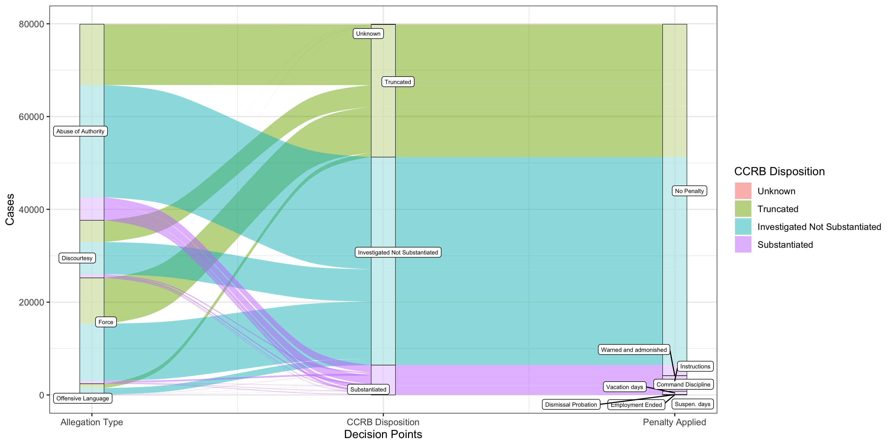
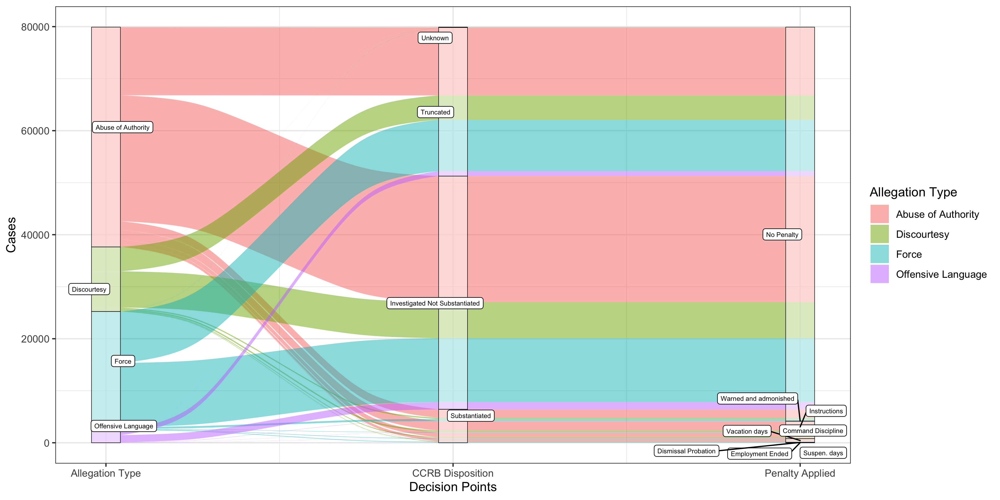
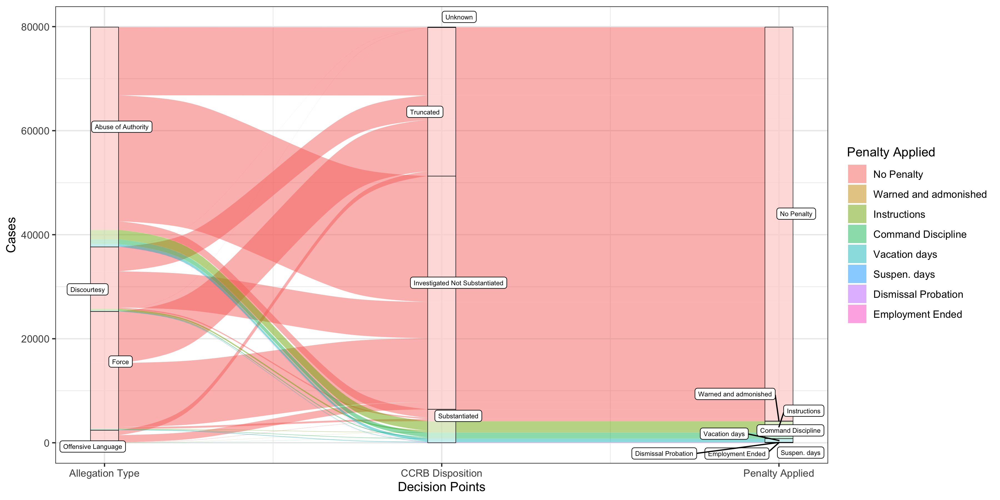

```{r setup, include=FALSE}
knitr::opts_chunk$set(echo = TRUE)
```

### Key questions

* How many complaints are there?

--

* How many officers are their complaints against?

--

* What types of allegations are most common?

--

* **At what stage(s) are complaints getting diverted away from penalties to the officer?**

--

* What happens to complaints when they are brought to the Civilian Complaint Review Board (CCRB)?

--

* What happens to complaints deemed 'substantiated' by the CCRB when brought to the NYPD?

---

### Load packages

```{r, warning=FALSE, message=FALSE}
# load packages
library(tidyverse)
library(ggalluvial)
library(ggrepel)

# set ggplot theme
theme_set(theme_bw())

# load cleaned data
load('nypd_ccrb_data_clean.rda')
```

---

### What types of allegations are being made?

Make a dataframe with the 20 most frequent allegations between 2010-2020

```{r}
alleg = complaints %>%
  dplyr::filter(IncidentDate >= "2010-01-01",
                IncidentDate < "2020-01-01") %>%
  count(FADOType, Allegation) %>%
  mutate(Allegation = fct_reorder(Allegation, n)) %>%
  top_n(n = 20, wt = n)
```

--

Plot to compare frequencies of allegation types

```{r}
top_allegations = ggplot(alleg, aes(x = Allegation, y = n, color = FADOType)) +
  geom_point() +
  geom_segment(aes(x = Allegation, xend = Allegation,
                   y = 0, yend = n)) +
  coord_flip() +
  labs(y = 'Number of Allegations 2010-2019') +
  theme(axis.ticks = element_blank()) +
  scale_y_continuous(expand = c(0, 0), limits = c(0, 18000))

```

---

class: center, middle

```{r, echo=FALSE, fig.asp = 3/4, dev = "svglite"}
top_allegations
```

---

### How many unique officers are there complaints against each year?

Pull just the year out of `IncidentDate`

```{r}
complaints = mutate(complaints, year = lubridate::year(IncidentDate))
```

--

Get the number of unique officers with complaints for each year

```{r}
officers_yearly = complaints %>%
  group_by(year) %>%
  summarise(n_officers = length(unique(UniqueId))) %>%
  dplyr::filter(year >= 1985, year < 2020)
```

---

### Plot number of officers as a function of year

```{r}
officers_year_plot = ggplot(officers_yearly,
                            aes(x = year, y = n_officers)) +
  geom_point() +
  geom_line() +
  labs(x = 'Year',
       y = 'Number of officers with at least 1 CCRB complaint') +
  theme(text = element_text(face='bold'))
```

---

class: center, middle

```{r, echo = F, fig.asp = 3/4, dev = "svglite"}
officers_year_plot
```

---

### What kinds of allegations does the CCRB find are substantiated?

--

```{r}
# group complaints by type (FADOType and CCRB disposition)
substantiated = complaints %>%
  dplyr::filter(IncidentDate >= "2010-01-01") %>%
  count(FADOType, BoardDispositionShort) 
```

--

The number of cases by type and CCRB decision 

```{r}
num_substantiated_plt = ggplot(substantiated,
                               aes(x = BoardDispositionShort,
                                   y = n,
                                   color = FADOType)) +
  geom_point(position = position_dodge(0.4)) +
  geom_linerange(position = position_dodge(.4),
                 aes(ymin = 0, ymax = n)) +
  coord_flip() +
  labs(y = "Number of cases 2010-2019",
       x = 'CCPD Status',
       color = 'Complaint Type')
```

---

class: center, middle

```{r, echo = FALSE, fig.asp = 3/4, dev = "svglite"}
num_substantiated_plt
```

---

### Maybe also helpful to see the _proportion_ substantiated of each type

```{r}
prop_substantiated_plt = complaints %>%
  dplyr::filter(IncidentDate >= "2010-01-01") %>%
  group_by(FADOType) %>%
  summarise(n = n(), 
            substantiated = sum(BoardDispositionShort == 'Substantiated')) %>%
  mutate(substantiated_proportion = substantiated/n) %>% 
  ggplot(data = .,
         aes(x = FADOType, y = substantiated_proportion)) +
  geom_point(size = 2) +
  expand_limits(y = 0) +
  labs(x = 'Complaint Type',
       y = 'Proportion of Cases Substantiated')
```

---

class: center, middle

```{r, echo = FALSE, fig.asp = 3/4, dev = "svglite"}
prop_substantiated_plt
```

---

### If the CCRB finds a complaint to be substantiated, what tends to be the outcome? 

Filter only substantiated complaints, count by the penalty applied

```{r}
substantiated_penalties = complaints %>%
  dplyr::filter(IncidentDate >= "2010-01-01", 
                BoardDispositionShort == 'Substantiated') %>%
  count(PenaltyDesc) %>%
  mutate(PenaltyDesc = fct_reorder(PenaltyDesc, n))
```

---

Make barplot
```{r}
penalty_barplot = ggplot(substantiated_penalties,
                         aes(x = PenaltyDesc, y = n)) +
  geom_bar(stat = 'identity', fill = 'blue', alpha = .5) +
  geom_text(aes(label=n),hjust=0, vjust=0) +
  ylim(0,2500) +
  coord_flip() +
  labs(x = '',
       y = 'Number of Cases',
       title = 'Outcomes of cases CCPD decided as substantiated')
```

---

class: center, middle

```{r, echo = FALSE, fig.asp = 3/4, dev = "svglite"}
penalty_barplot
```

---

### Can we trace the *flow* of complaints better?

* By type of allegation

--

* What happens at CCRB

--

* What happens in the outcome

--

Maybe alluvial plots can help....

using the [`ggalluvial`](https://cran.r-project.org/web/packages/ggalluvial/vignettes/ggalluvial.html) package

---

Summarize the data, grouping by:

* complaint type (`FADOType`)
* CCRB Disposition (`BoardDispositionShort`)
* penalty applied (`PenaltyDesc`)

```{r, warning=FALSE}
alluvial_summary = complaints %>%
  dplyr::filter(IncidentDate >= "2010-01-01") %>%
  count(FADOType, BoardDispositionShort, PenaltyDesc) %>%
  mutate(freq = n)
```

---

Make the alluvial plot

--

* Multiple axes have to be created here

--

* `geom_alluvium()` makes the flowy stuff

--

* `geom_stratum()` makes the boxes

--

* `ggrepel::geom_label_repel()` labels the boxes, avoiding collisions

---

```{r}
al_disp1 = alluvial_summary %>%
  ggplot(data = ., 
         aes(y = freq,
             axis1 = FADOType,
             axis2 = BoardDispositionShort,
             axis3 = PenaltyDesc)) +
  geom_alluvium(aes(fill = BoardDispositionShort), width = 1/12) +
  geom_stratum(width = 1/12, alpha = .5, lwd = .2) +
  scale_x_continuous(breaks = 1:3,
                     labels = c('Allegation Type',
                                'CCRB Disposition',
                                'Penalty Applied')) + 
  ggrepel::geom_label_repel(stat = "stratum",
                            aes(label = after_stat(stratum)),
                            reverse = TRUE,
                            size = 2,
                            direction = 'both',
                            segment.alpha = 1,
                            label.padding = .2) +
  labs(y = 'Cases', x = 'Decision Points', fill = 'CCRB Disposition')
```

```{r, echo = FALSE}
ggsave('figures/al_disp1.png', al_disp1, device = 'png', width = 12, height = 6)
```

---

class: center, middle

```{r, echo = F}

```

---

Another alluvial plot option, filling in the color by type...

```{r}
al_disp2 = alluvial_summary %>%
  ggplot(data = ., 
         aes(y = freq,
             axis1 = FADOType,
             axis2 = BoardDispositionShort,
             axis3 = PenaltyDesc)) +
  geom_alluvium(aes(fill = FADOType), width = 1/12) +
  geom_stratum(width = 1/12, alpha = .5, lwd = .2) +
  scale_x_continuous(breaks = 1:3, labels = c('Allegation Type',
                                              'CCRB Disposition',
                                              'Penalty Applied')) + 
  ggrepel::geom_label_repel(stat = "stratum",
                            aes(label = after_stat(stratum)),
                            reverse = TRUE,
                            size = 2,
                            direction = 'both',
                            segment.alpha = 1,
                            label.padding = .2) +
  labs(y = 'Cases', x = 'Decision Points', fill = 'Allegation Type')
```

```{r, echo = FALSE}
ggsave('figures/al_disp2.png', al_disp2, device = 'png', width = 12, height = 6)
```

---

class: center, middle

```{r, echo = F}

```

---

Another alluvial plot option, filling in the color by the eventual penalty applied

```{r}
al_disp3 = alluvial_summary %>%
  ggplot(data = ., 
         aes(y = freq,
             axis1 = FADOType,
             axis2 = BoardDispositionShort,
             axis3 = PenaltyDesc)) +
  geom_alluvium(aes(fill = PenaltyDesc), width = 1/12) +
  geom_stratum(width = 1/12, alpha = .5, lwd = .2) +
  scale_x_continuous(breaks = 1:3, labels = c('Allegation Type',
                                              'CCRB Disposition',
                                              'Penalty Applied')) + 
  ggrepel::geom_label_repel(stat = "stratum",
                            aes(label = after_stat(stratum)),
                            reverse = TRUE,
                            size = 2,
                            direction = 'both',
                            segment.alpha = 1,
                            label.padding = .2) +
  labs(y = 'Cases', x = 'Decision Points', fill = 'Penalty Applied')
```

```{r, echo = FALSE}
ggsave('figures/al_disp3.png', al_disp3, device = 'png', width = 12, height = 6)
```

---

class: center, middle

```{r, echo = FALSE}

```

---

### Wrapping up

--

There is a **lot** in this dataset, and there is also a **lot** that is missing from this dataset.

--

* What incidents aren't being reported, and why?

--

* What is *actually* happening at each level?

--

* Are complaints being treated differently based on the gender/race/age of the person filing the complaint?

--

What goals can this dataset serve? What would we want to be able to know?


Thank you to the [NYCLU](https://www.nyclu.org) for making the data available!


